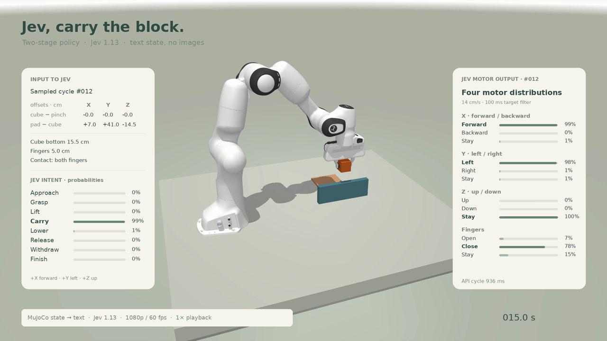
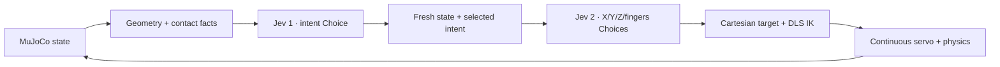

# Jev as Policy · MuJoCo Studio

<p align="center">
  
</p>

<p align="center"><b>Text state → Jev intent → Jev motor choices → local IK → MuJoCo</b></p>

This repository is a self-contained reproduction of the public **Jev as Policy** control structure. It includes the MuJoCo scene, Franka Panda assets, TypeSafe/Jev integration, continuous Cartesian servo, recording pipeline, and the studio-style web panel.

The demo task is:

> grasp the orange wooden block, lift it above the blue barrier, carry it to the tan pad, release it, and withdraw.

The included panel recording is a reference result from this exact harness:

**[Watch the 1080p / 60 fps panel demo](media/jev-carry-block-1080p60.mp4)**

## What this reproduces

Jev is used as a structured decision model. It does not receive images and does not output joint trajectories. The local harness turns MuJoCo geometry and contact state into text/JSON, then performs two sequential TypeSafe calls:



The first request chooses `approach`, `grasp`, `lift`, `carry`, `lower`, `release`, `withdraw`, or `finish`. The second request chooses `positive`, `negative`, or `stay` for each axis and `open`, `close`, or `stay` for the fingers. Each Choice returns the selected label, probabilities, and confidence. See the official [System One](https://docs.typesafe.ai/concepts/system-one), [State](https://docs.typesafe.ai/concepts/state), and [Choice](https://docs.typesafe.ai/primitives/choice) documentation.

The API key stays outside the repository. Jev is served remotely by TypeSafe; no Jev weights are downloaded to the simulation machine.

## Quick start

Python 3.12 is the tested baseline. A Linux machine with an EGL-capable GPU is recommended for the live panel and high-resolution video export. CPU rendering can work after changing `MUJOCO_GL` in `start.sh`.

```bash
git clone https://github.com/YuanKJing/Jev-as-Policy.git
cd Jev-as-Policy
python3.12 -m venv .venv
source .venv/bin/activate
python -m pip install -r requirements.txt
```

Set your own Jev API key in one of these ways:

```bash
export TYPESAFE_API_KEY='your_jev_api_key'
# or:
export JEV_API_KEY='your_jev_api_key'
```

For a one-shot command, the launcher also accepts a key directly:

```bash
bash start.sh --api-key 'your_jev_api_key' --open
```

For a local key file:

```bash
bash start.sh --key-file "$HOME/.config/typesafe/jev-key.py" --open
```

The key file may contain a single quoted string or a simple Python assignment such as `API_KEY = "..."`. It is read only by the server process and is never sent to the browser or written to logs.

Start the paused simulation panel:

```bash
bash start.sh --open
```

Open `http://127.0.0.1:8094/`. The service starts paused. The panel has:

- **录制搬运演示**: reset, run the Jev/MuJoCo episode, record physics states, and export the panel video;
- **暂停 / 重置**: stop or reset the simulation;
- **查看录像**: play the panel recording;
- **隐藏面板 / 全屏 / 数据**: prepare a clean live view, fullscreen presentation, or inspect actual observations and API responses.

## Reproduce the reference episode

1. Start the panel with your own key.
2. Click **录制搬运演示**.
3. Wait for `PLACEMENT COMPLETE`.
4. Use **查看录像** to play the single panel recording.

Each run is saved under `experiments/run_YYYYMMDD_HHMMSS/` with:

- `replay.mp4`: panel video, 1920×1080, 60 fps;
- `recording.npz`: recorded MuJoCo joint states and wall-clock timestamps;
- `decisions.jsonl`: both Jev responses, probabilities, selected labels, and before/after observations;
- `report.json`: task result, contact state, placement stability, and controller parameters;
- `export_progress.json`: actual video export metadata.

The video is rendered from recorded physics states on the original wall-clock timeline. It does not replay fabricated actions or silently remove API wait time. The current fast configuration uses a 14 cm/s free-space servo, 6 cm/s contact servo, 100 ms target filtering, and a 20 ms low-level update interval. The first API connection is warmed before recording starts so cold-start latency does not make the task look slower than the task itself.

## Command-line and code layout

| File | Purpose |
| --- | --- |
| `jev_policy.py` | Loads the runtime key and performs the two TypeSafe/Jev calls. |
| `app.py` | MuJoCo state, continuous servo, IK, episode recording, and HTTP API. |
| `build_scene.py` | Rebuilds the local Panda scene, lighting, table, barrier, block, and pad. |
| `studio.py` | Camera and panel overlay used by the live view and panel video. |
| `export_video.py` | Renders recorded states to the panel MP4 with NVENC when available. |
| `index.html` | The browser panel. |
| `start.sh` | Creates the scene, starts Uvicorn, and optionally opens Chrome. |
| `assets/franka_emika_panda/` | Included Panda mesh assets and source license. |

The HTTP API is intentionally small:

```text
GET  /             panel
GET  /api/state    current state and latest Jev result
GET  /stream.mjpg  live 1080p preview
POST /api/demo     reset and start a recorded episode
POST /api/pause    pause and invalidate the current command
POST /api/reset    reset the scene
GET  /replay.mp4   latest panel recording
```

## Reproducibility notes

The public post describes the two-stage mechanism but does not publish the author's complete prompt, scene, controller, or private code. This repository is a transparent implementation of that mechanism, not a claim that the private original source has been recovered. See [`docs/provenance.md`](docs/provenance.md) for source and license details.

The scene is simulation-only. It does not import PiPER, CAN, RealSense, xpolicy, or any real-robot driver. Replacing MuJoCo truth with real perception and robot state is a separate integration task.

## License

The repository's launcher and harness are released under the repository license. Panda assets retain their upstream license in [`assets/franka_emika_panda/LICENSE`](assets/franka_emika_panda/LICENSE).
